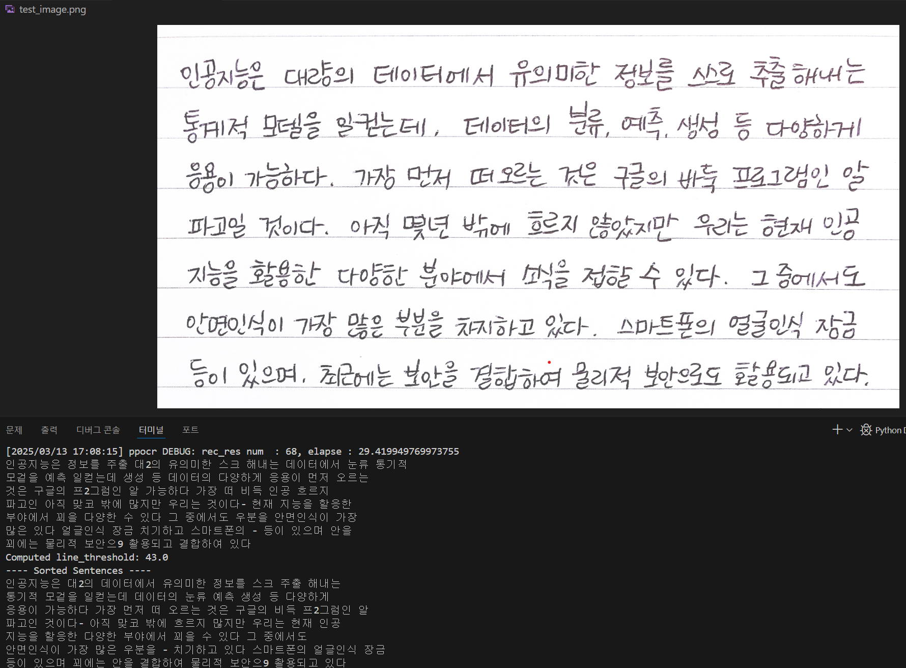

작업 PC : window11, gram 노트북, cpu 사용

가상 환경 : python 3.7

깃 클론          git clone https://github.com/PaddlePaddle/Paddle

라이브러리 설치  conda install paddlepaddle==2.5.0 --channel https://mirrors.tuna.tsinghua.edu.cn/anaconda/cloud/Paddle/

클론한 Paddle의 요구사항 설치 cd Paddle/python, pip install -r requirements.txt, pip install opencv-python matplotlib paddleocr

각종 버전 에러 처리

pip install protobuf==3.20.2

pip install "urllib3<2.0"

====

ocr이 인식한 단어가 마구잡이로 정렬되기에 각 단어 좌표를 통해 문장 단위로 정렬하여 출력하도록 변경

====

임의로 ocr 성능 테스트를 위한 이미지에서 잘 인식하지 못했던 단어들 위주로 추가 학습하려 하였으나, 잘못된 깃을 클론한 것을 발견하였습니다.

https://github.com/PaddlePaddle/Paddle이 아닌 https://github.com/PaddlePaddle/PaddleOCR 클론 후 다시 시도